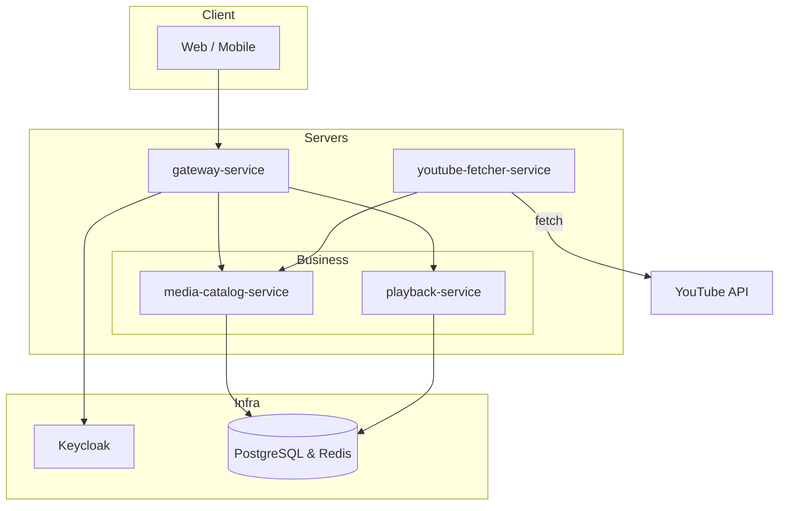

# LoopIn Microservice Platform

A collection of Kotlin/Spring Boot services that together provide the **LoopIn** media platform. The system is designed with a micro-service architecture, containerised with Docker and Kubernetes, and delivered through GitOps with Argo CD.

---

## 🗺️ Architecture



> Zone legend: **Client** (users), **Servers** (application layer including gateway & business services), **Infra** (authentication & data storage). External traffic reaches `gateway-service`, which routes to core services (`media-catalog-service`, `playback-service`). `youtube-fetcher-service` is an internal worker that pulls data from the YouTube Data API into the catalog. Persistence is handled by PostgreSQL and Redis; Keycloak provides OAuth2.

---

## 📦 Services

| Service                   | Port (internal) | Description                                                                                                       |
| ------------------------- | --------------- | ----------------------------------------------------------------------------------------------------------------- |
| `gateway-service`         | 59000 (default) | Entry-point; routes requests, enforces CORS, rate-limiting, and JWT authentication. Overrides via `SERVER_PORT`.  |
| `media-catalog-service`   | 59001           | Stores media items & playlists, exposes CRUD+search APIs, caches hot data in Redis.                               |
| `playback-service`        | 59002           | Tracks user playback history & statistics; consumes catalog APIs.                                                 |
| `youtube-fetcher-service` | 59011           | Internal worker (no public API); fetches playlists/videos from YouTube Data API and pushes them into the catalog. |
| **Backing (Keycloak)**    | 59022           | OAuth2 provider realm `loopin`; holds users & client registrations.                                               |
| **Shared Infra**          | 5432 / 6379     | PostgreSQL & Redis instances used by services.                                                                    |

---

## ⛓️ Local Development

1. **Prerequisites**

   - Java 21
   - Docker & Docker Compose
   - (Optional) kubectl + kind/minikube for Kubernetes testing

2. **Spin-up full stack**

   ```bash
   cd loopin-deployment/docker
   docker compose up --build
   ```

   ‑ The compose file starts all services plus Keycloak, Postgres, and Redis.
   ‑ Keycloak realm is pre-seeded (see `loopin-deployment/docker/keycloak/realm-export.json`).

3. **Run a single service** (hot-reloading)

   ```bash
   cd media-catalog-service
   ./gradlew bootRun
   ```

   Environment variables are picked up from `src/main/resources/application.yml`.

---

## 🚀 Deployment (Production)

- **Kubernetes** manifests live under `*/k8s` for each service.
- **base** contains the raw Deployment, Service & ConfigMap; **overlays/production** adds replicas/resources.
- The **argocd/** directory defines Argo CD `Application` manifests that point to those overlays.
- CI/CD pipeline (not included here) builds the images, pushes to registry, and Argo CD handles sync.

---

## 📑 Database Migrations

Both `media-catalog-service` and `playback-service` use Flyway. SQL files are located in:

```
media-catalog-service/src/main/resources/db/migration
playback-service/src/main/resources/db/migration
```

Migrations run automatically on application startup.

---

## 🔧 Tech Stack

- Kotlin / Spring Boot 3.x
- Spring Cloud Gateway & Security
- PostgreSQL + Flyway
- Redis (Lettuce client)
- Docker, Docker Compose, Kubernetes
- GitOps with Argo CD

---

## 📝 Contributing

1. Fork & clone this repo.
2. Create a feature branch – `git checkout -b feat/my-feature`.
3. Commit your changes – make sure the **Gradle** build passes.
4. Open a PR targeting `main`.

---

## 📄 License

This project is licensed under the MIT License.
