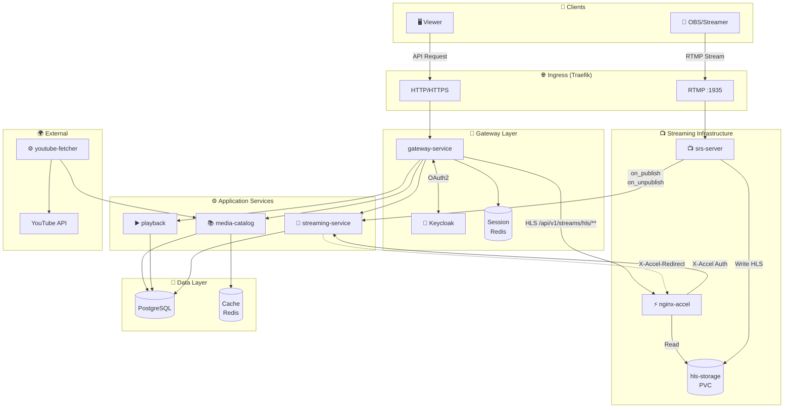

# LoopIn Microservice Platform

A collection of Kotlin/Spring Boot services that together provide the **LoopIn** media platform. The system is designed with a micro-service architecture, containerised with Docker and Kubernetes, and delivered through GitOps with Argo CD.

---

## 🗺️ Architecture


```mermaid
flowchart TB
  subgraph Clients["👥 Clients"]
    C["🖥️ Viewer"]
    OBS["🎥 OBS/Streamer"]
  end

  subgraph Ingress["🌐 Ingress (Traefik)"]
    ING_HTTP["HTTP/HTTPS"]
    ING_RTMP["RTMP :1935"]
  end

  subgraph Gateway["🚪 Gateway Layer"]
    G["gateway-service"]
    KC["🔐 Keycloak"]
    GR[("Session<br/>Redis")]
  end

  subgraph Services["⚙️ Application Services"]
    MC["📚 media-catalog"]
    PB["▶️ playback"]
    ST["📡 streaming-service"]
  end

  subgraph Streaming["📺 Streaming Infrastructure"]
    NA["⚡ nginx-accel"]
    SRS["📺 srs-server"]
    HLS[("hls-storage<br/>PVC")]
  end

  subgraph Data["💾 Data Layer"]
    PG[("PostgreSQL")]
    RD[("Cache<br/>Redis")]
  end

  subgraph External["🌍 External"]
    YT["YouTube API"]
    YF["⚙️ youtube-fetcher"]
  end

  %% Client to Ingress
  C -->|API Request| ING_HTTP
  OBS -->|RTMP Stream| ING_RTMP

  %% Ingress Routing
  ING_HTTP --> G
  ING_RTMP --> SRS

  %% Gateway connections
  G <-->|OAuth2| KC
  G --> GR
  G --> MC & PB & ST

  %% Service to Data
  MC --> PG
  MC --> RD
  PB --> PG
  ST --> PG

  %% YouTube Fetcher
  YF --> MC
  YF --> YT

  %% HLS Streaming Flow (gateway routes to nginx-accel)
  G -->|HLS /api/v1/streams/hls/**| NA
  NA -->|X-Accel Auth| ST
  ST -.->|X-Accel-Redirect| NA
  NA -->|Read| HLS

  %% SRS Flow
  SRS -->|on_publish<br/>on_unpublish| ST
  SRS -->|Write HLS| HLS
```

> **Architecture Overview:**
>
> - **Ingress Layer**: Traefik handles HTTP traffic and RTMP streaming (`:1935` via IngressRouteTCP).
> - **Gateway**: `gateway-service` routes API requests to backend services, manages sessions (Redis), and authenticates via Keycloak OAuth2.
> - **Application Services**: `media-catalog`, `playback`, and `streaming-service` handle business logic with PostgreSQL persistence.
> - **Streaming Infrastructure**:
>   - **OBS/Streamer** → RTMP → **srs-server**: Receives live streams, transcodes to HLS, writes to shared `hls-storage` PVC.
>   - **srs-server** → **streaming-service**: Calls `on_publish`/`on_unpublish` webhooks for stream lifecycle management.
>   - **Viewer** → **gateway-service** → **nginx-accel** → **streaming-service**: HLS requests (`/api/v1/streams/hls/**`) routed through gateway; `streaming-service` returns `X-Accel-Redirect` header.
>   - **nginx-accel** → **hls-storage**: Serves HLS files directly from shared PVC (internal location).
> - **External**: `youtube-fetcher-service` syncs playlists from YouTube Data API into `media-catalog`.

---

## 📦 Services

| Service                   | Port (internal) | Description                                                                                                       |
| ------------------------- | --------------- | ----------------------------------------------------------------------------------------------------------------- |
| `gateway-service`         | 59000 (default) | Entry-point; routes requests, enforces CORS, rate-limiting, JWT authentication, and Redis-backed session management. |
| `media-catalog-service`   | 59001           | Stores media items & playlists, exposes CRUD+search APIs, caches hot data in Redis.                               |
| `playback-service`        | 59002           | Tracks user playback history & statistics; consumes catalog APIs.                                                 |
| `streaming-service`       | 59003           | Real-time video streaming with HLS; handles live streams, video conversion, and multi-resolution adaptive streaming. |
| `youtube-fetcher-service` | 59011           | Internal worker (no public API); fetches playlists/videos from YouTube Data API and pushes them into the catalog. |
| **Backing (Keycloak)**    | 59022           | OAuth2 provider realm `loopin`; holds users & client registrations.                                               |
| **Shared Infra**          | 5432 / 6379     | PostgreSQL (media-catalog, playback, streaming) & Redis (gateway session, media-catalog cache/rate-limit).        |

---

## ⛓️ Local Development

1. **Prerequisites**

   - Java 21
   - Docker & Docker Compose
   - (Optional) kubectl + kind/minikube for Kubernetes testing

2. **Spin-up full stack**

   ```bash
   cd loopin-deployment/docker
   docker compose up --build
   ```

   ‑ The compose file starts all services plus Keycloak, Postgres, and Redis.
   ‑ Keycloak realm is pre-seeded (see `loopin-deployment/docker/keycloak/realm-export.json`).

3. **Run a single service** (hot-reloading)

   ```bash
   cd media-catalog-service
   ./gradlew bootRun
   ```

   Environment variables are picked up from `src/main/resources/application.yml`.

---

## 🚀 Deployment (Production)

- **Kubernetes** manifests live under `*/k8s` for each service.
- **base** contains the raw Deployment, Service & ConfigMap; **overlays/production** adds replicas/resources.
- The **argocd/** directory defines Argo CD `Application` manifests that point to those overlays.
- CI/CD pipeline (not included here) builds the images, pushes to registry, and Argo CD handles sync.

---

## 📑 Database Migrations

All services (`media-catalog-service`, `playback-service`, `streaming-service`) use Flyway. SQL files are located in:

```
media-catalog-service/src/main/resources/db/migration
playback-service/src/main/resources/db/migration
streaming-service/src/main/resources/db/migration
```

Migrations run automatically on application startup.

---

## 📺 Streaming Features

The `streaming-service` provides real-time video streaming capabilities:

### HLS Streaming
- **Adaptive Bitrate**: Supports 240p, 360p, 480p, and 720p resolutions
- **Segmented Delivery**: 6-second video segments for smooth playback
- **Master Playlists**: Automatic resolution switching based on network conditions

### Video Processing
- **FFmpeg Integration**: Real-time video conversion using JavaCV
- **Multi-Resolution Encoding**: Parallel processing for different quality levels
- **Live Stream Support**: Real-time segment generation and delivery

### API Endpoints
- `POST /api/v1/streams` - Create new stream session
- `GET /api/v1/streams/{key}/playlist.m3u8` - Master HLS playlist
- `GET /api/v1/streams/{key}/{resolution}/playlist.m3u8` - Resolution-specific playlist
- `GET /api/v1/streams/{key}/{resolution}/{segment}.ts` - Video segments

---

## 🔧 Tech Stack

- Kotlin / Spring Boot 3.x
- Spring Cloud Gateway & Security
- Spring WebFlux (Reactive Programming)
- PostgreSQL + Flyway
- Redis (Lettuce client)
- FFmpeg / JavaCV (Video Processing)
- HLS (HTTP Live Streaming)
- Docker, Docker Compose, Kubernetes
- GitOps with Argo CD

---

## 📝 Contributing

1. Fork & clone this repo.
2. Create a feature branch – `git checkout -b feat/my-feature`.
3. Commit your changes – make sure the **Gradle** build passes.
4. Open a PR targeting `main`.

---

## 📄 License

This project is licensed under the MIT License.
