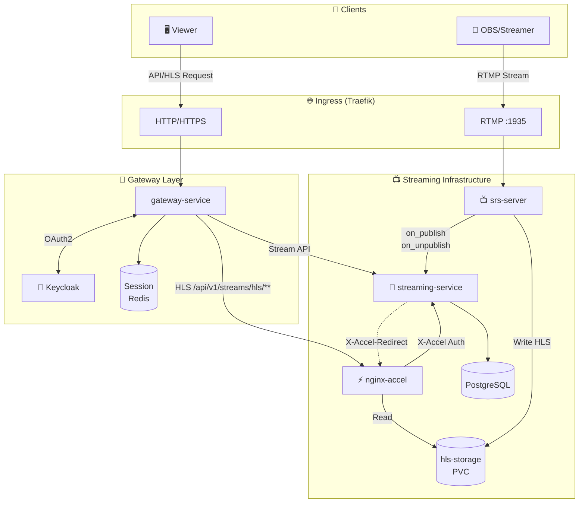

# Streaming Architecture

실시간 비디오 스트리밍 인프라 구조를 설명합니다.

---

## 🗺️ Architecture



---

## 📡 Streaming Flow

### 1. 송출 (Publish)

```
OBS/Streamer
    │
    │ RTMP Stream
    ▼
Traefik (IngressRouteTCP :1935)
    │
    ▼
srs-server
    │
    ├──► on_publish webhook ──► streaming-service (인증/상태 관리)
    │
    └──► HLS 파일 생성 ──► hls-storage PVC
```

1. **OBS/Streamer**가 RTMP로 스트림 송출
2. **Traefik**이 IngressRouteTCP로 RTMP 트래픽을 srs-server로 라우팅
3. **srs-server**가 `on_publish` 웹훅으로 streaming-service에 인증 요청
4. **streaming-service**가 스트림 키 검증 후 스트림 상태를 LIVE로 변경
5. **srs-server**가 HLS 파일(.m3u8, .ts)을 hls-storage PVC에 생성

### 2. 시청 (Playback)

```
Viewer
    │
    │ HLS Request (GET /api/v1/streams/hls/{publicId}/...)
    ▼
Traefik (Ingress HTTP/HTTPS)
    │
    ▼
gateway-service
    │
    │ Route: /api/v1/streams/hls/** → nginx-accel-service
    ▼
nginx-accel
    │
    │ Proxy to streaming-service
    ▼
streaming-service
    │
    │ X-Accel-Redirect: /_internal/hls/...
    ▼
nginx-accel
    │
    │ Internal redirect
    ▼
hls-storage PVC ──► HLS 파일 응답
```

1. **Viewer**가 HLS 요청 (`/api/v1/streams/hls/...`)
2. **Traefik**이 HTTP 요청을 gateway-service로 라우팅
3. **gateway-service**가 `/api/v1/streams/hls/**` 경로를 nginx-accel-service로 라우팅
4. **nginx-accel**이 `/api/v1/streams` 경로를 streaming-service로 프록시
5. **streaming-service**가 publicId → streamKey 매핑 후 `X-Accel-Redirect` 헤더 반환
6. **nginx-accel**이 internal location에서 HLS 파일을 직접 서빙

---

## 🔧 Components

| Component | Role | Ports |
|-----------|------|-------|
| **streaming-service** | 스트림 세션 관리, 인증, X-Accel-Redirect 처리 | 8080 |
| **srs-server** | RTMP 수신, HLS 변환, 웹훅 호출 | 1935 (RTMP), 1985 (API), 8080 (HTTP) |
| **nginx-accel** | HLS 요청 프록시, X-Accel-Redirect 처리, 파일 서빙 | 80 |
| **hls-storage PVC** | HLS 파일 공유 스토리지 (srs-server ↔ nginx-accel) | - |

---

## 📁 HLS File Structure

srs-server가 생성하는 HLS 파일 구조:

```
hls-storage/
└── abr/
    └── live/
        ├── {streamKey}_720p/
        │   ├── index.m3u8
        │   ├── 0.ts
        │   ├── 1.ts
        │   └── ...
        └── {streamKey}_360p/
            ├── index.m3u8
            ├── 0.ts
            └── ...
```

---

## 🔐 X-Accel-Redirect Pattern

nginx-accel이 streaming-service와 협력하여 HLS 파일을 안전하게 제공하는 패턴:

### nginx-accel 설정

```nginx
# 공개 진입점: streaming-service로 프록시
location /api/v1/streams {
  proxy_pass http://streaming-service;
}

# 내부 전용: 실제 HLS 파일 서빙
location /_internal/hls/ {
  internal;              # 클라이언트 직접 접근 차단
  alias /hlsroot/;
}
```

### streaming-service 응답

```kotlin
// ViewerController.kt
@GetMapping("/hls/{slug}/seg/{variant}/{file}")
fun seg(...): Mono<ResponseEntity<Void>> {
    return mapSlugToSecret(slug).map { secret ->
        val internalPath = "/_internal/hls/abr/live/${secret}_${variant}/$file"
        ResponseEntity.ok()
            .header("X-Accel-Redirect", internalPath)
            .build()
    }
}
```

---

## 🪝 SRS Webhooks

srs-server가 streaming-service로 호출하는 웹훅:

### on_publish

스트림 송출 시작 시 호출:

```json
POST /api/v1/hooks/on_publish
{
  "app": "live",
  "stream": "your-stream-key",
  "ip": "client-ip"
}
```

- 스트림 키 검증
- 스트림 상태를 LIVE로 변경
- 성공: `{"code": 0}`, 실패: `{"code": 1}`

### on_unpublish

스트림 송출 종료 시 호출:

```json
POST /api/v1/hooks/on_unpublish
{
  "app": "live",
  "stream": "your-stream-key"
}
```

- 스트림 상태를 ENDED로 변경

